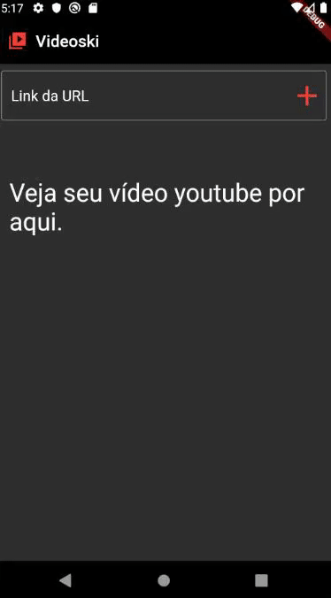
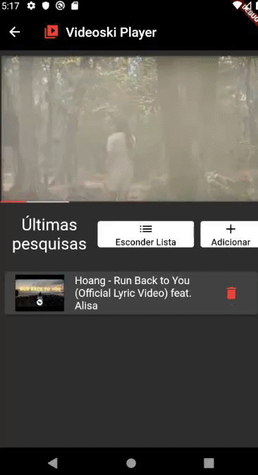

# VIDEOSKI APP

Aplicativo mobile para renderizar vídeos do YouTube desenvolvido em Flutter com o intuito de permitir que o usuário acesse vídeos através da plataforma com qualidade de resolução garantida. Nessa aplicação, fiz o uso de animações como os Widgets AnimatedContainer e AnimatedPositioned, o MobX para controlar o state junto com o GetIT para servir para injeção de dependência, especialmente do controller sobre os outros componentes na aplicação, o youtube_player_flutter foi usado para renderizar o vídeo pela URL do youtube. Eu usei o pacote HTTP para fazer requisições para certas API, principalmente uma do próprio youtube que retorna informação do vídeo através da URL do mesmo.

Video application developed in Flutter in order to allow the user to access youtube videos through the platform with guaranteed resolution quality. In this application, I made use of animations such as the AnimatedContainer and AnimatedPositioned widgets, MobX to control the state together with GetIT to serve for dependency injection, especially the controller over the other components in the application, youtube_player_flutter was used to render the video by the youtube URL. I used the HTTP package to make requests for certain APIs, mainly one from youtube itself that returns video information through its URL.

# SCREENSHOTS - CAPTURAS DE TELA

 
    
        
        
    

# LIBRARIES - BIBLIOTECAS

- flutter
- mobx
- flutter_mobx
- get_it
- http
- youtube_player_flutter
- animated_text_kit
- flushbar
- mobx_codegen
- build_runner

Desevolvido por,

Developed by,

lucascicco.
 
